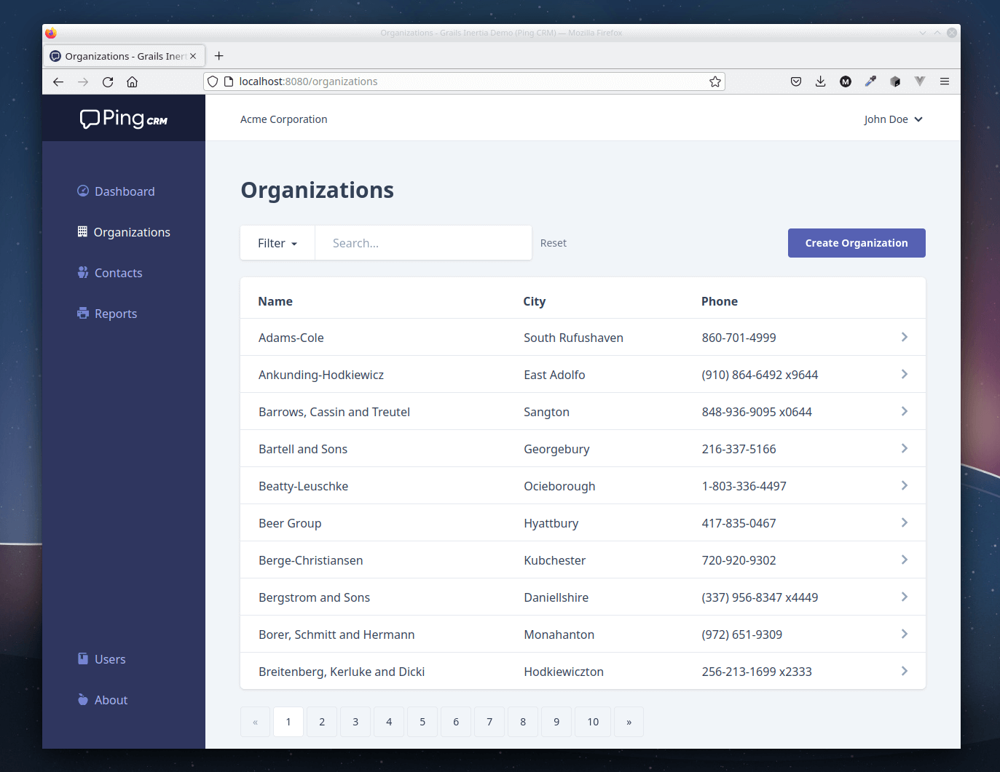

# Grails Adapter for Inertia.js

[](https://central.sonatype.com/artifact/io.github.matrei/grails-inertia-plugin) [](https://github.com/matrei/grails-inertia-plugin/actions/workflows/gradle-check.yml)

Grails plugin for using [Inertia.js](https://inertiajs.com/) to build single-page apps without building an API.

## What is Inertia.js?

Inertia.js lets you, in its own words, *“quickly build modern single-page React, Vue and Svelte apps using classic server-side routing and controllers”.*

Using Inertia.js allows using your favorite MVC server-side framework (Grails obviously) with your favorite client-side SPA framework - no need to build a separate API.

## Demo application
***Ping CRM*** is an application using this plugin\
**[Source](https://github.com/matrei/pingcrm-grails) | [Live Demo](https://pingcrm.mattiasreichel.com)**

>[!NOTE]
>This is a port to Grails/Groovy of the original [Ping CRM demo](https://github.com/inertiajs/pingcrm) written in Laravel/PHP. 



## Plugin Installation
If you don't have an application already:
```shell
grails create-app myapp
cd myapp
```
\
Add the plugin dependency to the project:
```groovy
// myapp/build.gradle
dependencies {
    //...
    // Replace $inertiaPluginVersion with a suitable release version for your project, or define it in ~/myapp/gradle.properties
    implementation "io.github.matrei:grails-inertia-plugin:$inertiaPluginVersion"
    //...
}
```
> [!NOTE]
> For a Grails 5/Java 8 - use the latest version of the plugin with major version 1.\
> For Grails 6/Java 11 - use the latest version of the plugin.

\
To add the client dependencies and workflow to a Grails project, create the following files: **(Vue 3 example)**
```javascript
// myapp/package.json (versions @ 2023-11-25) 
```
```json
{
  "name": "myapp",
  "version": "0.1.0",
  "private": true,
  "scripts": {
    "serve": "vite --port 3000",
    "build": "vite build && vite build --outDir src/main/resources/ssr --ssr src/main/javascript/ssr.js"
  },
  "dependencies": {
    "vue": "^3.3.9",
    "@inertiajs/vue3": "^1.0.14"
  },
  "devDependencies": {
    "@vitejs/plugin-vue": "^4.5.0",
    "vite": "^5.0.2"
  }
}
```
```javascript
// myapp/vite.config.js
import { fileURLToPath, URL } from 'node:url'
import { defineConfig } from 'vite'
import vue from '@vitejs/plugin-vue'

export default defineConfig(({ command }) => ({
  base: command === 'serve' ? '' : '/static/dist/',
  publicDir: false,
  build: {
    manifest: true,
    outDir: 'src/main/resources/public/dist',
    assetsDir: 'js',
    rollupOptions: {
      input: 'src/main/javascript/main.js'
    }
  },
  plugins: [vue()],
  resolve: {
    alias: {
      '@': fileURLToPath(new URL('./src/main/javascript', import.meta.url))
    }
  },
  server: {
    // Needed for changes to picked up when running in WSL on Windows
    watch: {
      usePolling: true
    }
  }
}))
```
```javascript
// myapp/src/main/javascript/main.js
import { createApp, h } from 'vue'
import { createInertiaApp } from '@inertiajs/vue3'

createInertiaApp({
  resolve: async (name) => {
    const pages = import.meta.glob('./Pages/**/*.vue')
    return (await pages[`./Pages/${name}.vue`]()).default
  },
  setup ({el, App, props, plugin}) {
    createApp({ render: () => h(App, props) })
      .use(plugin)
      .mount(el)
  }
})
```
```javascript
// myapp/src/main/javascript/ssr.js (Optional, for Server Side Rendering)
import { createSSRApp, h } from 'vue'
import { createInertiaApp } from '@inertiajs/vue3'
import createServer from '@inertiajs/vue3/server'
import { renderToString } from '@vue/server-renderer'

createServer(page =>
    createInertiaApp({
        page,
        render: renderToString,
        resolve: async (name) => {
            const pages = import.meta.glob('./Pages/**/*.vue')
            return (await pages[`./Pages/${name}.vue`]()).default
        },
        setup({ App, props, plugin }) {
            return createSSRApp({
                render: () => h(App, props)
            })
            .use(plugin)
        }
    })
)
```
\
It can be a good idea to add the following entries to your .gitignore
```gitignore
# myapp/.gitignore
# ...
node_modules
src/main/resources/public/dist
```
\
And run the following command to install the client dependencies:
```shell
npm install
```

## Usage
In your Grails controllers, you can now select which JavaScript Page Component to render and pass the values of the props to it.
```groovy
// myapp/grails-app/controllers/myapp/BookController.groovy
package myapp

class BookController {
    
    def index() {
        def books = ['Grails in Action', 'Programming Grails', 'The Definitive Guide to Grails 2']
        renderInertia 'Books/Index', [books: books]
    }
}
```
Here is an example Vue 3 Single File Component to that will render the books as a list.
```vue
<!-- myapp/src/main/javascript/Pages/Books/Index.vue -->
<script setup>
defineProps({ books: Array })
</script>
<template>
  <ul>
    <li v-for="book in books">{{ book }}</li>
  </ul>
</template>
```
\
For development with [Hot Module Replacement](https://vitejs.dev/guide/features.html#hot-module-replacement) of the application run: (in separate terminals)
```shell
npm run serve
```
```shell
./gradlew bootRun
```
\
For production or test, first build the production version of your JavaScript app...
```shell
npm run build
```
\
...and then run whatever you want to do:
```shell
./gradlew integrationTest
./gradlew bootJar
```
### SSR
To enable server-side rendering, make sure a Node.js version compatible with your client-side app is installed and added
to the PATH on your system and add the following to your `application.yml`:
```yaml
inertia:
  ssr:
    enabled: true
    url: 'http://localhost:13714/render'
    bundle: 'src/main/resources/ssr/ssr.mjs'
```