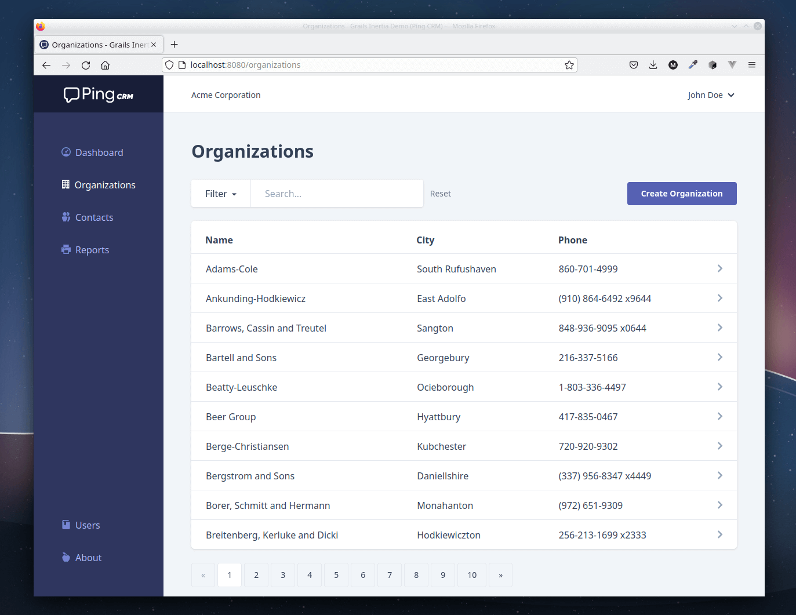

# 🧩 Grails Adapter for Inertia.js

[](https://central.sonatype.com/artifact/io.github.matrei/grails-inertia) [](https://github.com/matrei/grails-inertia-plugin/actions/workflows/gradle-check.yml)

Grails plugin for using [Inertia.js](https://inertiajs.com/) to build single-page apps without building an API.

## ❔ What is Inertia.js?

Inertia.js lets you, in its own words, *“quickly build modern single-page React, Vue and Svelte apps using classic server-side routing and controllers”.*

Using Inertia.js allows using your favorite MVC server-side framework (Grails obviously) with your favorite client-side SPA framework - no need to build a separate API.

## 🎬 Demo application

***Ping CRM*** is an application using this plugin\
**[Source](https://github.com/matrei/pingcrm-grails) | [Live Demo](https://pingcrm.mattiasreichel.com)**

>[!NOTE]
>This is a port to Grails/Groovy of the original [Ping CRM demo](https://github.com/inertiajs/pingcrm) written in Laravel/PHP. 



## 📦 Plugin Installation

If you don't have an application already:
```shell
grails create-app myapp
cd myapp
```
\
Add the plugin dependency to the project:
```groovy
// myapp/build.gradle
dependencies {
    //...
    // Replace $inertiaPluginVersion with a suitable release version for your project, or define it in ~/myapp/gradle.properties
    implementation "io.github.matrei:grails-inertia:$inertiaPluginVersion"
    //...
}
```
> [!NOTE]
> For Grails 8/Java 21 - use the latest version of the plugin.\
> For Grails 7/Java 17 - use version 3.\
> For Grails 6/Java 11 - use version 2 (io.github.matrei:grails-inertia-plugin).\
> For a Grails 5/Java 8 - use version 1 (io.github.matrei:grails-inertia-plugin).

\
To add the client dependencies and workflow to a Grails project, create the following files: **(Vue 3 example)**
```javascript
// myapp/package.json (versions checked 2026-08-20)
```
```json
{
  "name": "myapp",
  "version": "0.1.0",
  "private": true,
  "scripts": {
    "serve": "vite --port 3000",
    "build": "vite build && vite build --outDir src/main/resources/ssr --ssr src/main/javascript/ssr.js"
  },
  "dependencies": {
    "vue": "^3.5.41",
    "@inertiajs/vue3": "^3.7.0"
  },
  "devDependencies": {
    "@vitejs/plugin-vue": "^6.0.8",
    "@inertiajs/vite": "^3.7.0",
    "vite": "^8.2.2"
  }
}
```
```javascript
// myapp/vite.config.js
import { fileURLToPath, URL } from 'node:url'
import { defineConfig } from 'vite'
import inertia from '@inertiajs/vite'
import vue from '@vitejs/plugin-vue'

export default defineConfig(({ command }) => ({
  base: command === 'serve' ? '' : '/static/dist/',
  publicDir: false,
  build: {
    manifest: true,
    outDir: 'src/main/resources/public/dist',
    assetsDir: 'js',
    rollupOptions: {
      input: 'src/main/javascript/main.js'
    }
  },
  plugins: [vue(), inertia({ ssr: false })],
  resolve: {
    alias: {
      '@': fileURLToPath(new URL('./src/main/javascript', import.meta.url))
    }
  },
  server: {
    // Needed for changes to picked up when running in WSL on Windows
    watch: {
      usePolling: true
    }
  }
}))
```
> [!NOTE]
> The plugin reads the Vite manifest from `classpath:public/dist/.vite/manifest.json`, which matches the `outDir` above.\
> If you change `outDir`, set `inertia.manifest.location` in `application.yml` to the new location.

```javascript
// myapp/src/main/javascript/main.js
import { createApp, createSSRApp, h } from 'vue'
import { createInertiaApp } from '@inertiajs/vue3'

createInertiaApp({
  pages: './Pages',
  setup ({el, App, props, plugin}) {
    const app = el.dataset.serverRendered === 'true'
      ? createSSRApp({ render: () => h(App, props) })
      : createApp({ render: () => h(App, props) })
    app
      .use(plugin)
      .mount(el)
  }
})
```
```javascript
// myapp/src/main/javascript/ssr.js (Optional, for Server Side Rendering)
import { createSSRApp, h } from 'vue'
import { createInertiaApp } from '@inertiajs/vue3'
import createServer from '@inertiajs/vue3/server'
import { renderToString } from '@vue/server-renderer'

createServer(page =>
    createInertiaApp({
        page,
        render: renderToString,
        pages: './Pages',
        setup({ App, props, plugin }) {
            return createSSRApp({
                render: () => h(App, props)
            })
            .use(plugin)
        }
    })
)
```
\
It can be a good idea to add the following entries to your .gitignore
```gitignore
# myapp/.gitignore
# ...
node_modules
src/main/resources/public/dist
```
\
And run the following command to install the client dependencies:
```shell
npm install
```

## 📖 Usage

In your Grails controllers, you can now select which JavaScript Page Component to render and pass the values of the props to it.
```groovy
// myapp/grails-app/controllers/myapp/BookController.groovy
package myapp

class BookController {
    
    def index() {
        def books = ['Grails in Action', 'Programming Grails', 'The Definitive Guide to Grails 2']
        renderInertia('Books/Index', [books: books])
    }
}
```
The name of the page component is its path below `src/main/javascript/Pages`, without the `.vue` extension, so
`Books/Index` renders `src/main/javascript/Pages/Books/Index.vue`. The name must match the file name exactly,
including upper and lower case, also on file systems that ignore case. A page that does not exist fails with
`Page not found: Books/Index`.

Here is an example Vue 3 Single File Component to that will render the books as a list.
```vue
<!-- myapp/src/main/javascript/Pages/Books/Index.vue -->
<script setup>
defineProps({ books: Array })
</script>
<template>
  <ul>
    <li v-for="book in books">{{ book }}</li>
  </ul>
</template>
```
\
For development with [Hot Module Replacement](https://vitejs.dev/guide/features.html#hot-module-replacement) of the application run: (in separate terminals)
```shell
npm run serve
```
```shell
./gradlew bootRun
```
\
For production or test, first build the production version of your JavaScript app...
```shell
npm run build
```
\
...and then run whatever you want to do:
```shell
./gradlew integrationTest
./gradlew bootJar
```
### Vite dev server

In the `development` environment, the page loads the JavaScript from the Vite dev server. In all other environments,
it loads the assets built by Vite, as listed in the Vite manifest. The dev server, its URL and the entry point of the
JavaScript application can be configured:
```yaml
# myapp/grails-app/conf/application.yml
inertia:
  vite:
    devServer:
      enabled: true # Defaults to true in development and false otherwise
      url: 'http://localhost:3000' # Optional, this is the default value
    entry: 'src/main/javascript/main.js' # Optional, this is the default value
```

To use the dev server in another environment as well, for example in `test`, enable it for that environment:
```yaml
# myapp/grails-app/conf/application.yml
environments:
  test:
    inertia:
      vite:
        devServer:
          enabled: true
```

### Favicon

The favicon can be configured without overriding the Inertia HTML template.
Place the icon in `src/main/resources/public/`, which Grails serves under `/static/`, and point the config at it:
```yaml
# myapp/grails-app/conf/application.yml
inertia:
  favicon: '/static/favicon.svg' # served from src/main/resources/public/favicon.svg
```

A root-relative value (starting with a single `/`) is resolved against the application's context path.
Any other value, such as an absolute URL, is used as-is.
The link is omitted when no favicon is configured.

### Title

The page title shown until a page component sets its own defaults to the application name (`info.app.name`),
which the Grails build sets to the name of the project. A different title can be configured:
```yaml
# myapp/grails-app/conf/application.yml
inertia:
  title: 'My App'
```

The title is omitted when a server-side rendered page provides its own title.

### Language

The `lang` attribute of the page is the locale Grails resolves for the request, so it follows a language chosen with
the `?lang=` parameter. By default, Grails falls back to the language of the browser when none has been chosen.
An application in a single language should use a fixed locale instead:
```yaml
# myapp/grails-app/conf/application.yml
grails:
  i18n:
    localeResolver: fixed
    default:
      locale: en
```

The `lang` attribute is set when the page is loaded. When the language is switched with an Inertia visit, the
application needs to update `document.documentElement.lang` itself, or switch the language with a full page load.

### Context path

When the application is deployed with a context path (`server.servlet.context-path`), the plugin prefixes it to
the URLs of the built JavaScript and CSS files. Vite also writes the `base` path into the built files, so it must
include the context path as well:
```javascript
// myapp/vite.config.js
export default defineConfig(({ command }) => ({
  base: command === 'serve' ? '' : '/myapp/static/dist/', // With server.servlet.context-path: /myapp
  // ...
}))
```

### ⚙️ SSR

To enable server-side rendering, make sure Node.js 22 or later is installed and available on the PATH.
The Grails adapter starts the production SSR bundle when `inertia.ssr.enabled` is true. Build the client and SSR
bundles before starting the Grails application:
```shell
npm run build
```

Then add the following to your `application.yml`:
```yaml
inertia:
  ssr:
    enabled: true # Defaults to false
    url: 'http://localhost:13714/render' # Optional, this is the default value
    bundle: 'src/main/resources/ssr/ssr.mjs' # Optional, this is the default value
    connect-timeout: 1000 # Optional, this is the default value, in milliseconds
    read-timeout: 5000 # Optional, this is the default value, in milliseconds
```

The `@inertiajs/vite` plugin is configured with `ssr: false` in this example because the Grails adapter manages the
production SSR process. SSR failures fall back to normal client-side rendering.

## Upgrading to 4.0

- The plugin requires Grails 8 and Java 21. Applications on Grails 7 can keep using version 3.
- The page requires the Inertia 3 client. The page data is now rendered in a `<script type="application/json">`
  element, which the Inertia 3 client reads, instead of the `data-page` attribute of the app element. Upgrade the
  `@inertiajs` packages to version 3 (see [Inertia 3 support](#inertia-3-support)).
- Outside the `development` environment, the page now loads the built assets by default, including in `test` and in
  custom environments. Before, it loaded the JavaScript from the Vite dev server at `http://localhost:3000` in every
  environment except `production`. The Vite manifest was already required outside `development`, so tests that render
  the page need the built assets, for example by making `processResources` depend on the Vite build, or they can keep
  using the dev server by setting `inertia.vite.devServer.enabled: true` for `test`
  (see [Vite dev server](#vite-dev-server)).
- The page now has a title until a page component sets its own: the application name, or `inertia.title` when it is
  configured (see [Title](#title)). Before, the page had no title.
- The `lang` attribute of the page is now the locale resolved for the request, instead of always `en`. By default,
  Grails falls back to the language of the browser, so an application in a single language should use a fixed locale
  (see [Language](#language)).
- With a context path, the plugin now prefixes it to the URLs of the built JavaScript and CSS files, so a custom
  template or other workaround for the context path is no longer needed (see [Context path](#context-path)).

## Inertia 3 support

The adapter supports the Inertia v3 page protocol, including:

- Partial reloads with `only`, `except`, and nested dot-notation paths.
- Lazy, optional, always, and deferred props.
- Merge, prepend, deep-merge, and once props.
- Infinite-scroll metadata and matching keys.
- Shared props, flash data, and page metadata.
- Fragment redirects and asset-version mismatch responses.

For example:
```groovy
renderInertia('Users/Index', [
    users: Inertia.merge({ loadUsers() }),
    permissions: Inertia.defer({ loadPermissions() }),
    settings: Inertia.once(loadSettings())
])
```

Inertia 3 also removes Axios from the client package, renames several client events, and replaces
`router.cancel()` with `router.cancelAll()`. See the [Inertia upgrade guide](https://inertiajs.com/docs/v3/getting-started/upgrade-guide)
when upgrading an existing frontend.

### Page controls

Page history and redirect behavior can be controlled from a Grails controller. These controls apply to the page
returned by the current request:

```groovy
class AccountController {
    def settings() {
        encryptInertiaHistory()
        renderInertia('Account/Settings', [account: currentAccount()])
    }

    def reset() {
        clearInertiaHistory()
        renderInertia('Account/Reset')
    }

    def rename() {
        preserveInertiaFragment()
        redirect(uri: '/account/settings')
    }
}
```

The equivalent static methods are `Inertia.encryptHistory()`, `Inertia.clearHistory()`, and
`Inertia.preserveFragment()`. They emit the v3 `encryptHistory`, `clearHistory`, and `preserveFragment` page
properties when enabled. Empty or disabled properties are omitted from the JSON response.
